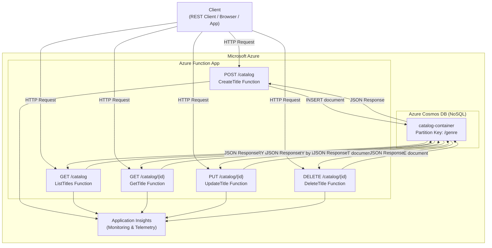
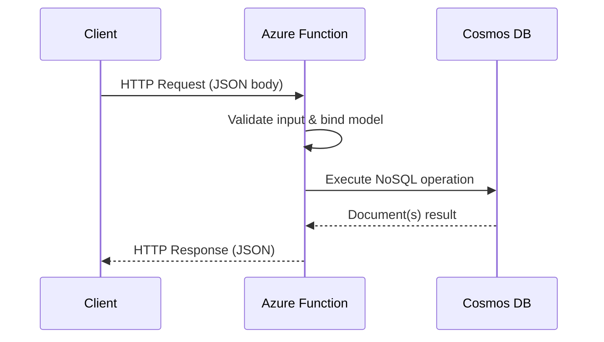

# Netflix Catalog Manager — Azure Functions + CosmosDB

<div align="center">

[](https://azure.microsoft.com/en-us/products/functions)
[](https://azure.microsoft.com/en-us/products/cosmos-db)
[](https://azure.microsoft.com/en-us/solutions/serverless)
[](https://dotnet.microsoft.com/)
[](LICENSE)

**Gerenciador de Catálogos da Netflix com arquitetura serverless na Azure**
**| Netflix Catalog Manager with serverless architecture on Azure**

*Desafio de Projeto — DIO AZ-204: Developing Solutions for Microsoft Azure*

</div>

---

## Sumário / Table of Contents

- [Visão Geral / Overview](#visao-geral--overview)
- [Arquitetura / Architecture](#arquitetura--architecture)
- [Tecnologias / Technologies](#tecnologias--technologies)
- [Endpoints da API / API Endpoints](#endpoints-da-api--api-endpoints)
- [Estrutura do Projeto / Project Structure](#estrutura-do-projeto--project-structure)
- [Configuração / Setup](#configuracao--setup)
- [Desenvolvimento Local / Local Development](#desenvolvimento-local--local-development)
- [Deploy na Azure / Azure Deploy](#deploy-na-azure--azure-deploy)
- [Exemplos de Uso / Usage Examples](#exemplos-de-uso--usage-examples)
- [Licença / License](#licenca--license)

---

## Visão Geral / Overview

### PT-BR

Este projeto implementa uma **API serverless completa** para gerenciamento de catálogos de streaming no estilo Netflix, utilizando **Azure Functions** como camada de computação e **Azure Cosmos DB** como banco de dados NoSQL gerenciado. Desenvolvido como parte do desafio prático da certificação **AZ-204 (Developing Solutions for Microsoft Azure)** na plataforma DIO.

A proposta é demonstrar na prática como construir microsserviços orientados a eventos e APIs HTTP escaláveis sem gerenciar infraestrutura — pagando apenas pelo que é consumido. O catálogo expõe operações completas de **CRUD** (Create, Read, Update, Delete) para títulos de filmes e séries.

**Casos de uso principais:**
- Cadastrar novos títulos no catálogo (filmes e séries)
- Listar todo o catálogo ou filtrar por gênero, tipo ou ano
- Buscar um título específico por ID
- Atualizar metadados de um título existente
- Remover títulos descontinuados do catálogo

### English

This project implements a **complete serverless API** for managing Netflix-style streaming catalogs, using **Azure Functions** as the compute layer and **Azure Cosmos DB** as the managed NoSQL database. Developed as part of the hands-on challenge for the **AZ-204 (Developing Solutions for Microsoft Azure)** certification on the DIO platform.

The goal is to demonstrate in practice how to build event-driven microservices and scalable HTTP APIs without managing infrastructure — paying only for what is consumed. The catalog exposes full **CRUD** operations (Create, Read, Update, Delete) for movies and TV series.

---

## Arquitetura / Architecture



### Fluxo de dados / Data Flow



---

## Tecnologias / Technologies

| Tecnologia | Versao / Version | Finalidade / Purpose |
|---|---|---|
| Azure Functions | v4 (.NET isolated) | Computacao serverless / Serverless compute |
| Azure Cosmos DB | NoSQL API | Banco de dados de documentos / Document database |
| .NET | 8.0 LTS | Runtime da aplicacao / Application runtime |
| C# | 12 | Linguagem principal / Main language |
| Azure Functions Core Tools | v4 | Desenvolvimento e deploy local / Local dev & deploy |
| Application Insights | Latest | Monitoramento e telemetria / Monitoring & telemetry |
| Azure CLI | Latest | Provisionamento de infra / Infrastructure provisioning |

---

## Endpoints da API / API Endpoints

### Base URL

```
Local:  http://localhost:7071/api
Azure:  https://<function-app-name>.azurewebsites.net/api
```

---

### POST /catalog — Criar titulo / Create title

Cadastra um novo titulo no catalogo.

**Request Body:**

```json
{
  "title": "Stranger Things",
  "type": "series",
  "genre": "sci-fi",
  "year": 2016,
  "seasons": 4,
  "rating": 8.7,
  "description": "A group of kids in the 80s uncover supernatural mysteries in their small town.",
  "cast": ["Millie Bobby Brown", "Finn Wolfhard", "David Harbour"],
  "language": "en",
  "available": true
}
```

**Response `201 Created`:**

```json
{
  "id": "a3f2c891-4d70-4e1b-bb3f-98a1c7d6e2f0",
  "title": "Stranger Things",
  "type": "series",
  "genre": "sci-fi",
  "year": 2016,
  "seasons": 4,
  "rating": 8.7,
  "description": "A group of kids in the 80s uncover supernatural mysteries in their small town.",
  "cast": ["Millie Bobby Brown", "Finn Wolfhard", "David Harbour"],
  "language": "en",
  "available": true,
  "createdAt": "2024-01-15T10:30:00Z",
  "updatedAt": "2024-01-15T10:30:00Z"
}
```

---

### GET /catalog — Listar catalogo / List catalog

Retorna todos os titulos. Suporta filtros por query string.

**Query Parameters (opcionais / optional):**

| Parametro | Tipo | Descricao |
|---|---|---|
| `genre` | string | Filtrar por genero (sci-fi, drama, action...) |
| `type` | string | Filtrar por tipo (movie, series) |
| `year` | int | Filtrar por ano de lancamento |
| `available` | bool | Filtrar por disponibilidade |

**Exemplos / Examples:**

```
GET /catalog
GET /catalog?genre=drama
GET /catalog?type=movie&year=2023
GET /catalog?available=true
```

**Response `200 OK`:**

```json
{
  "total": 2,
  "items": [
    {
      "id": "a3f2c891-4d70-4e1b-bb3f-98a1c7d6e2f0",
      "title": "Stranger Things",
      "type": "series",
      "genre": "sci-fi",
      "year": 2016,
      "rating": 8.7,
      "available": true
    },
    {
      "id": "b7e1d204-9c33-4f8a-ae10-5f3bc9a1d847",
      "title": "The Crown",
      "type": "series",
      "genre": "drama",
      "year": 2016,
      "rating": 8.6,
      "available": true
    }
  ]
}
```

---

### GET /catalog/{id} — Buscar titulo / Get title by ID

Retorna os detalhes completos de um titulo especifico.

**Path Parameter:**

| Parametro | Tipo | Descricao |
|---|---|---|
| `id` | string (GUID) | Identificador unico do titulo |

**Response `200 OK`:**

```json
{
  "id": "a3f2c891-4d70-4e1b-bb3f-98a1c7d6e2f0",
  "title": "Stranger Things",
  "type": "series",
  "genre": "sci-fi",
  "year": 2016,
  "seasons": 4,
  "rating": 8.7,
  "description": "A group of kids in the 80s uncover supernatural mysteries in their small town.",
  "cast": ["Millie Bobby Brown", "Finn Wolfhard", "David Harbour"],
  "language": "en",
  "available": true,
  "createdAt": "2024-01-15T10:30:00Z",
  "updatedAt": "2024-01-15T10:30:00Z"
}
```

**Response `404 Not Found`:**

```json
{
  "error": "Title not found",
  "id": "a3f2c891-4d70-4e1b-bb3f-98a1c7d6e2f0"
}
```

---

### PUT /catalog/{id} — Atualizar titulo / Update title

Atualiza os dados de um titulo existente no catalogo.

**Request Body (campos opcionais / optional fields):**

```json
{
  "rating": 9.0,
  "seasons": 5,
  "available": false,
  "description": "Updated description with new season information."
}
```

**Response `200 OK`:**

```json
{
  "id": "a3f2c891-4d70-4e1b-bb3f-98a1c7d6e2f0",
  "title": "Stranger Things",
  "type": "series",
  "genre": "sci-fi",
  "year": 2016,
  "seasons": 5,
  "rating": 9.0,
  "available": false,
  "updatedAt": "2024-06-20T14:45:00Z"
}
```

---

### DELETE /catalog/{id} — Remover titulo / Delete title

Remove permanentemente um titulo do catalogo.

**Response `200 OK`:**

```json
{
  "message": "Title successfully deleted",
  "id": "a3f2c891-4d70-4e1b-bb3f-98a1c7d6e2f0"
}
```

**Response `404 Not Found`:**

```json
{
  "error": "Title not found",
  "id": "a3f2c891-4d70-4e1b-bb3f-98a1c7d6e2f0"
}
```

---

### Codigos de Resposta / Response Codes

| Codigo / Code | Significado / Meaning |
|---|---|
| `200 OK` | Operacao bem-sucedida / Successful operation |
| `201 Created` | Recurso criado com sucesso / Resource created |
| `400 Bad Request` | Dados invalidos no corpo da requisicao / Invalid request body |
| `404 Not Found` | Titulo nao encontrado / Title not found |
| `500 Internal Server Error` | Erro interno do servidor / Internal server error |

---

## Estrutura do Projeto / Project Structure

```
netflix-catalog-manager-azure-functions/
├── src/
│   ├── NetflixCatalogManager/
│   │   ├── Functions/
│   │   │   ├── CreateTitleFunction.cs       # POST /catalog
│   │   │   ├── ListTitlesFunction.cs        # GET /catalog
│   │   │   ├── GetTitleFunction.cs          # GET /catalog/{id}
│   │   │   ├── UpdateTitleFunction.cs       # PUT /catalog/{id}
│   │   │   └── DeleteTitleFunction.cs       # DELETE /catalog/{id}
│   │   ├── Models/
│   │   │   ├── CatalogTitle.cs              # Modelo principal do documento
│   │   │   ├── CreateTitleRequest.cs        # DTO de criacao
│   │   │   ├── UpdateTitleRequest.cs        # DTO de atualizacao
│   │   │   └── CatalogListResponse.cs       # DTO de listagem
│   │   ├── Services/
│   │   │   └── CosmosDbService.cs           # Abstração das operacoes no Cosmos DB
│   │   ├── Program.cs                       # Configuracao da Function App (isolated)
│   │   └── NetflixCatalogManager.csproj
├── tests/
│   └── NetflixCatalogManager.Tests/
│       ├── Functions/
│       │   └── CatalogFunctionsTests.cs
│       └── NetflixCatalogManager.Tests.csproj
├── infra/
│   ├── provision.sh                         # Script de provisionamento Azure CLI
│   └── deploy.sh                            # Script de deploy
├── .gitignore
├── local.settings.json.example              # Template de configuracoes locais
└── README.md
```

---

## Configuracao / Setup

### Pre-requisitos / Prerequisites

- [.NET 8 SDK](https://dotnet.microsoft.com/download/dotnet/8.0)
- [Azure Functions Core Tools v4](https://learn.microsoft.com/en-us/azure/azure-functions/functions-run-local)
- [Azure CLI](https://learn.microsoft.com/en-us/cli/azure/install-azure-cli)
- [Azure Subscription](https://azure.microsoft.com/en-us/free/) (conta gratuita aceita / free account accepted)
- Opcional: [Azure Cosmos DB Emulator](https://learn.microsoft.com/en-us/azure/cosmos-db/local-emulator) para desenvolvimento local

### Instalacao das ferramentas / Tool Installation

```bash
# Instalar Azure Functions Core Tools
npm install -g azure-functions-core-tools@4 --unsafe-perm true

# Verificar instalacao
func --version

# Verificar Azure CLI
az --version
```

### Clonar o repositorio / Clone the repository

```bash
git clone https://github.com/galafis/netflix-catalog-manager-azure-functions.git
cd netflix-catalog-manager-azure-functions
```

### Configurar variaveis de ambiente / Configure environment variables

Copie o arquivo de exemplo e preencha com suas credenciais:

```bash
cp local.settings.json.example local.settings.json
```

Edite `local.settings.json`:

```json
{
  "IsEncrypted": false,
  "Values": {
    "AzureWebJobsStorage": "UseDevelopmentStorage=true",
    "FUNCTIONS_WORKER_RUNTIME": "dotnet-isolated",
    "CosmosDbConnectionString": "AccountEndpoint=https://<your-account>.documents.azure.com:443/;AccountKey=<your-key>;",
    "CosmosDbDatabaseName": "netflix-catalog",
    "CosmosDbContainerName": "titles"
  }
}
```

> Para usar o emulador local, substitua a connection string por:
> `AccountEndpoint=https://localhost:8081/;AccountKey=C2y6yDjf5/R+ob0N8A7Cgv30VRDJIWEHLM+4QDU5DE2nQ9nDuVTqobD4b8mGGyPMbIZnqyMssZo/D43eG9igT2w==;`

---

## Desenvolvimento Local / Local Development

### Restaurar dependencias / Restore dependencies

```bash
dotnet restore
```

### Executar localmente / Run locally

```bash
# Na pasta do projeto de funcoes
func start
```

A saida esperada: / Expected output:

```
Azure Functions Core Tools
Core Tools Version:       4.x.x
Function Runtime Version: 4.x.x

Functions:

    CreateTitle: [POST] http://localhost:7071/api/catalog
    ListTitles:  [GET]  http://localhost:7071/api/catalog
    GetTitle:    [GET]  http://localhost:7071/api/catalog/{id}
    UpdateTitle: [PUT]  http://localhost:7071/api/catalog/{id}
    DeleteTitle: [DELETE] http://localhost:7071/api/catalog/{id}
```

### Executar testes / Run tests

```bash
dotnet test
```

### Testar endpoints rapidamente / Quick endpoint testing

```bash
# Criar um titulo
curl -X POST http://localhost:7071/api/catalog \
  -H "Content-Type: application/json" \
  -d '{
    "title": "Dark",
    "type": "series",
    "genre": "sci-fi",
    "year": 2017,
    "seasons": 3,
    "rating": 8.8,
    "language": "de",
    "available": true
  }'

# Listar o catalogo
curl http://localhost:7071/api/catalog

# Buscar por ID
curl http://localhost:7071/api/catalog/<id-retornado>

# Atualizar
curl -X PUT http://localhost:7071/api/catalog/<id-retornado> \
  -H "Content-Type: application/json" \
  -d '{"rating": 9.1}'

# Deletar
curl -X DELETE http://localhost:7071/api/catalog/<id-retornado>
```

---

## Deploy na Azure / Azure Deploy

### 1. Login na Azure / Login to Azure

```bash
az login
```

### 2. Provisionar recursos / Provision resources

```bash
# Variaveis / Variables
RESOURCE_GROUP="rg-netflix-catalog"
LOCATION="eastus"
STORAGE_ACCOUNT="stnflxcatalog"
FUNCTION_APP="fn-netflix-catalog"
COSMOS_ACCOUNT="cosmos-netflix-catalog"
DB_NAME="netflix-catalog"
CONTAINER_NAME="titles"

# Criar Resource Group
az group create \
  --name $RESOURCE_GROUP \
  --location $LOCATION

# Criar Storage Account (obrigatorio para Functions)
az storage account create \
  --name $STORAGE_ACCOUNT \
  --location $LOCATION \
  --resource-group $RESOURCE_GROUP \
  --sku Standard_LRS

# Criar conta do Cosmos DB
az cosmosdb create \
  --name $COSMOS_ACCOUNT \
  --resource-group $RESOURCE_GROUP \
  --locations regionName=$LOCATION failoverPriority=0 isZoneRedundant=False

# Criar banco de dados no Cosmos DB
az cosmosdb sql database create \
  --account-name $COSMOS_ACCOUNT \
  --resource-group $RESOURCE_GROUP \
  --name $DB_NAME

# Criar container com partition key
az cosmosdb sql container create \
  --account-name $COSMOS_ACCOUNT \
  --resource-group $RESOURCE_GROUP \
  --database-name $DB_NAME \
  --name $CONTAINER_NAME \
  --partition-key-path "/genre" \
  --throughput 400

# Criar Function App (.NET isolated)
az functionapp create \
  --resource-group $RESOURCE_GROUP \
  --consumption-plan-location $LOCATION \
  --runtime dotnet-isolated \
  --runtime-version 8 \
  --functions-version 4 \
  --name $FUNCTION_APP \
  --storage-account $STORAGE_ACCOUNT
```

### 3. Configurar variaveis de ambiente na Azure / Configure environment variables

```bash
# Obter connection string do Cosmos DB
COSMOS_CONN=$(az cosmosdb keys list \
  --name $COSMOS_ACCOUNT \
  --resource-group $RESOURCE_GROUP \
  --type connection-strings \
  --query "connectionStrings[0].connectionString" \
  --output tsv)

# Definir configuracoes da Function App
az functionapp config appsettings set \
  --name $FUNCTION_APP \
  --resource-group $RESOURCE_GROUP \
  --settings \
    "CosmosDbConnectionString=$COSMOS_CONN" \
    "CosmosDbDatabaseName=$DB_NAME" \
    "CosmosDbContainerName=$CONTAINER_NAME"
```

### 4. Publicar / Publish

```bash
# Build e publicar
cd src/NetflixCatalogManager
func azure functionapp publish $FUNCTION_APP
```

---

## Exemplos de Uso / Usage Examples

### Cenario: Montar um catalogo de filmes de acao / Scenario: Building an action movie catalog

```bash
# Adicionar varios filmes
curl -X POST https://fn-netflix-catalog.azurewebsites.net/api/catalog \
  -H "Content-Type: application/json" \
  -d '{"title": "Extraction", "type": "movie", "genre": "action", "year": 2020, "rating": 6.7, "language": "en", "available": true}'

curl -X POST https://fn-netflix-catalog.azurewebsites.net/api/catalog \
  -H "Content-Type: application/json" \
  -d '{"title": "The Old Guard", "type": "movie", "genre": "action", "year": 2020, "rating": 6.6, "language": "en", "available": true}'

# Listar apenas filmes de acao
curl "https://fn-netflix-catalog.azurewebsites.net/api/catalog?genre=action&type=movie"
```

### Resposta esperada / Expected response:

```json
{
  "total": 2,
  "items": [
    {
      "id": "...",
      "title": "Extraction",
      "type": "movie",
      "genre": "action",
      "year": 2020,
      "rating": 6.7,
      "available": true
    },
    {
      "id": "...",
      "title": "The Old Guard",
      "type": "movie",
      "genre": "action",
      "year": 2020,
      "rating": 6.6,
      "available": true
    }
  ]
}
```

---

## Conceitos do Desafio DIO AZ-204 / DIO AZ-204 Challenge Concepts

Este projeto cobre os seguintes topicos do exame AZ-204:

| Topico / Topic | Implementacao / Implementation |
|---|---|
| Implement Azure Functions | HTTP trigger functions para cada operacao CRUD |
| Connect to Azure Cosmos DB | SDK CosmosClient com binding de saida |
| Implement serverless solutions | Consumption plan, pay-per-execution |
| Monitor Azure solutions | Application Insights integrado |
| Develop for Azure storage | CosmosDB como storage de documentos JSON |
| Implement API Management | Endpoints RESTful com versionamento |

---

## Licenca / License

```
MIT License

Copyright (c) 2024 Gabriel Demetrios Lafis

Permission is hereby granted, free of charge, to any person obtaining a copy
of this software and associated documentation files (the "Software"), to deal
in the Software without restriction, including without limitation the rights
to use, copy, modify, merge, publish, distribute, sublicense, and/or sell
copies of the Software, and to permit persons to whom the Software is
furnished to do so, subject to the following conditions:

The above copyright notice and this permission notice shall be included in all
copies or substantial portions of the Software.

THE SOFTWARE IS PROVIDED "AS IS", WITHOUT WARRANTY OF ANY KIND, EXPRESS OR
IMPLIED, INCLUDING BUT NOT LIMITED TO THE WARRANTIES OF MERCHANTABILITY,
FITNESS FOR A PARTICULAR PURPOSE AND NONINFRINGEMENT. IN NO EVENT SHALL THE
AUTHORS OR COPYRIGHT HOLDERS BE LIABLE FOR ANY CLAIM, DAMAGES OR OTHER
LIABILITY, WHETHER IN AN ACTION OF CONTRACT, TORT OR OTHERWISE, ARISING FROM,
OUT OF OR IN CONNECTION WITH THE SOFTWARE OR THE USE OR OTHER DEALINGS IN THE
SOFTWARE.
```

---

<div align="center">

Desenvolvido por **[Gabriel Demetrios Lafis](https://github.com/galafis)** como parte do ecossistema de projetos em Cloud e DevOps.

*Desafio AZ-204 — DIO (Digital Innovation One)*

</div>
