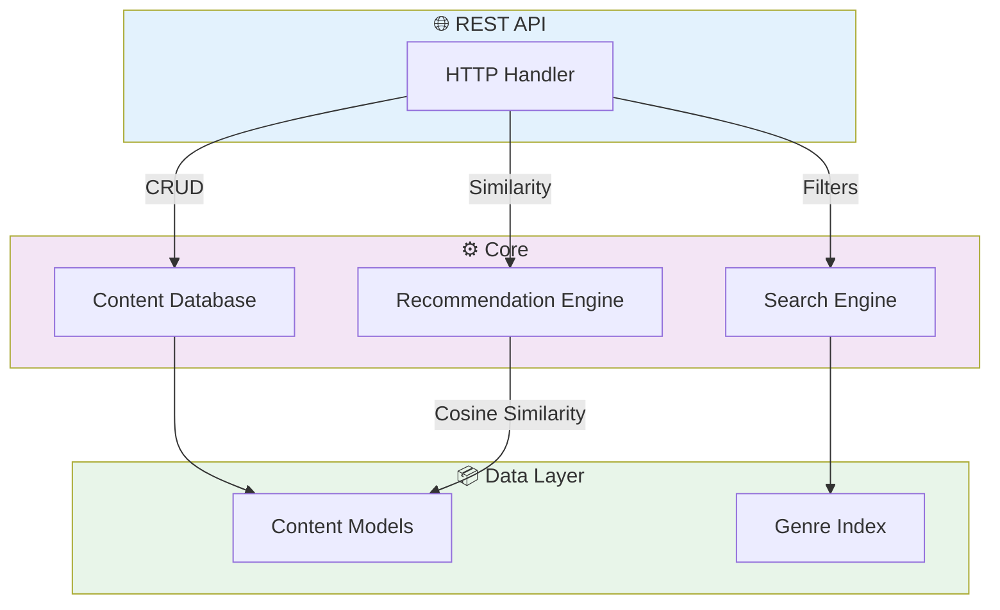

<div align="center">

# 🎬 Netflix Catalog Manager

**[Português](#português) | [English](#english)**

[](https://python.org)
[](LICENSE)

*Sistema de gerenciamento de catálogo de streaming com motor de recomendação / Streaming catalog management system with recommendation engine*

</div>

---

## Português

### 📋 Visão Geral

O **Netflix Catalog Manager** é um sistema completo de gerenciamento de catálogo para plataformas de streaming, implementado como uma API REST. Inclui CRUD de conteúdo, busca avançada com filtros, classificação por gênero e um motor de recomendação baseado em similaridade por cosseno (collaborative filtering).

### 🏗️ Arquitetura


```mermaid
graph TB
    subgraph API["🌐 REST API"]
        A[HTTP Handler]
    end

    subgraph Core["⚙️ Core"]
        B[Content Database]
        C[Search Engine]
        D[Recommendation Engine]
    end

    subgraph Data["📦 Data Layer"]
        E[Content Models]
        F[Genre Index]
    end

    A -->|CRUD| B
    A -->|Filters| C
    A -->|Similarity| D
    B --> E
    C --> F
    D -->|Cosine Similarity| E

    style API fill:#e3f2fd
    style Core fill:#f3e5f5
    style Data fill:#e8f5e9
```

### ✨ Funcionalidades

- **CRUD Completo**: Criar, ler, atualizar e deletar conteúdo
- **Busca Avançada**: Filtros por título, gênero, ano, rating e tipo
- **Motor de Recomendação**: Similaridade por cosseno com vetorização de features
- **Classificação por Gênero**: Catálogo organizado com índice de gêneros
- **15+ Conteúdos Demo**: Filmes, séries e documentários pré-carregados
- **25+ Testes Unitários**: Cobertura completa de todas as funcionalidades

### 🏭 Aplicações na Indústria

| Setor | Aplicação |
|-------|-----------|
| **Streaming** | Gerenciamento de catálogo para plataformas OTT |
| **E-commerce** | Recomendação de produtos por similaridade |
| **Educação** | Catálogo de cursos com sugestões personalizadas |
| **Mídia** | Organização e busca de conteúdo editorial |

### 🚀 Como Executar

```bash
git clone https://github.com/galafis/netflix-catalog-manager-azure-functions.git
cd netflix-catalog-manager-azure-functions
pip install -r requirements.txt
python main.py
```

---

## English

### 📋 Overview

**Netflix Catalog Manager** is a complete catalog management system for streaming platforms, implemented as a REST API. It includes content CRUD, advanced search with filters, genre classification, and a recommendation engine based on cosine similarity (collaborative filtering).

### ✨ Features

- **Full CRUD**: Create, read, update, and delete content
- **Advanced Search**: Filters by title, genre, year, rating, and type
- **Recommendation Engine**: Cosine similarity with feature vectorization
- **Genre Classification**: Organized catalog with genre index
- **15+ Demo Contents**: Pre-loaded movies, series, and documentaries
- **25+ Unit Tests**: Complete coverage of all features

### 🏭 Industry Applications

| Sector | Application |
|--------|-------------|
| **Streaming** | Catalog management for OTT platforms |
| **E-commerce** | Product recommendation by similarity |
| **Education** | Course catalog with personalized suggestions |
| **Media** | Editorial content organization and search |

### 🚀 Getting Started

```bash
git clone https://github.com/galafis/netflix-catalog-manager-azure-functions.git
cd netflix-catalog-manager-azure-functions
pip install -r requirements.txt
python main.py
```

---

## 👤 Autor / Author

**Gabriel Demetrios Lafis**
- GitHub: [@galafis](https://github.com/galafis)
- LinkedIn: [Gabriel Demetrios Lafis](https://linkedin.com/in/gabriel-demetrios-lafis)

## 📄 Licença / License

MIT License - see [LICENSE](LICENSE) for details.
